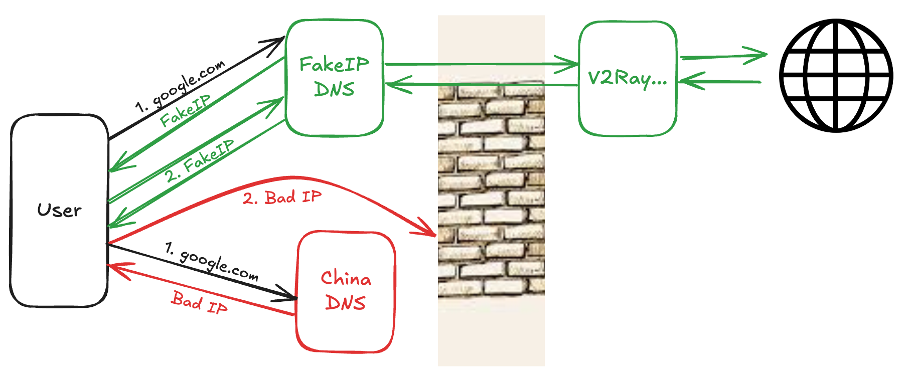
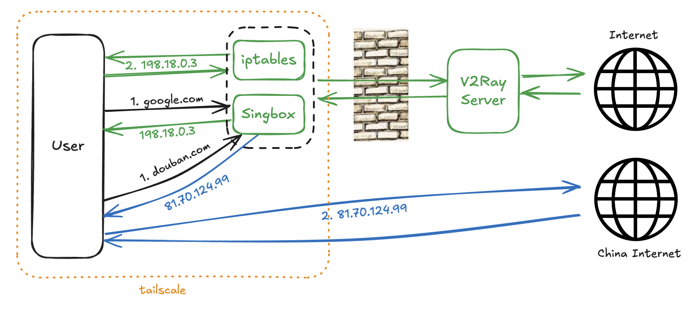
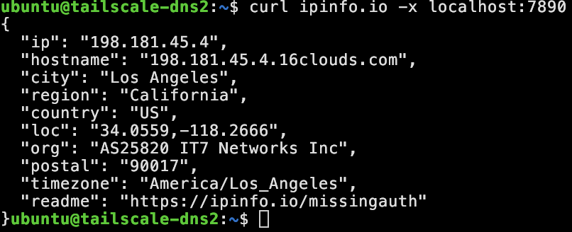
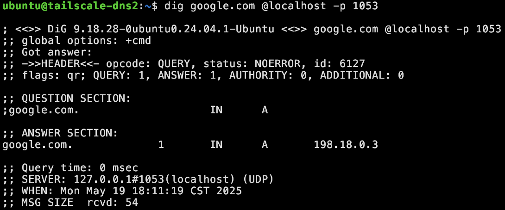
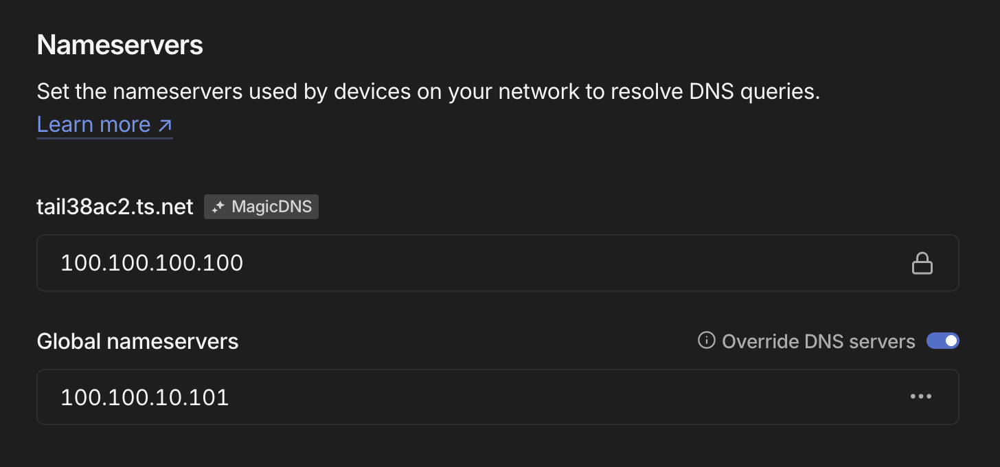
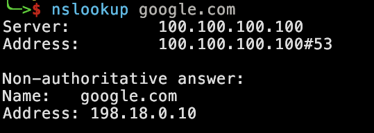

# Tailscale + Singbox FakeIP = Seamless VPN access

Recently I needed to connect my home Mac mini to GitHub as a runner. Unfornately, GitHub access is not stable in my country, so I need a seamless VPN solution. Previously I was using OpenClash, but never quite got it configured right, so this was the perfect opportunity to solve that too.

I’m using a solution I saw in the Neovim group on Telegram: Tailscale + FakeIP. It has these advantages:

- Automatic split-tunneling between domestic and overseas traffic seamlessly. Domestic traffic goes out via your normal local gateway. (Any FakeIP solution can do this, but using Tailscale’s native exit node alone cannot.)
- Outages of overseas services won’t take down domestic access, since only the overseas side would break. You just need to fix the overseas service.
- Connecting to Tailscale gives you access to both your home NAS and the Internet at once. Usually, you can only have one active VPN on mobile devices, but this solution give you benefits from both worlds.
- Simple to set up for friends or family, no complex config, and works on both home and mobile networks.

I’ve linked the original post and some reference configurations at the end of this post.

## Background

First, let’s review FakeIP. As you may know, DNS maps a domain name to an IP address. But in some countries, DNS often fails or returns the wrong IP, and even when it returns the correct IP, the connection may still be blocked. To solve that, you can roll your own DNS server(A) that always returns a placeholder IP, called a FakeIP, in a reserved IP range. When your app or browser asks DNS server(A) for “example.com,” it returns, let's say, `198.18.0.5`. Then you can configure your routing table to route "all request to `198.18.0.0/15`" to machine B, which have access to the real Internet. Machine B then do a reverse DNS look up, using the FakeIP(`198.18.0.5`), and finds out the real domain you intended, then it fetches the real site, relaying it backwards. Note that, in practice DNS A and machine B are probably the same machine.



Next, what is Tailscale? Simply put, Tailscale is a peer-to-peer VPN that stitches all your devices into one virtual LAN, so you can access your private services like you are on your home or office network.

Why do we combine them? Experienced users may have already set up FakeIP-based DNS/proxy on their OpenWrt router, so they can transparently browse overseas sites at home. But once you leave home, it no longer works. Tailscale gives you that same on-prem LAN experience from anywhere. You just point your DNS and routes to the tailnet’s internal FakeIP server, which is basically lifting your OpenWrt experience into the cloud.

## Implementation Steps

In my setup, I leveraged singbox’s built-in DNS (instead of the more popular mosdns). The overall architecture looks like this:



### Step 1. Buy a VPS server

Spin up a VPS server and join the tailnet. **NOTE**, allow all addresses to connect UDP in the security group.

### Step 2. Install Singbox

Install and configure singbox on the VPS. The full config is [here](sing-box/config.json).

```sh
sudo vi /etc/sing-box/config.json    # see the configuration in sing-box/config.json
sudo systemctl restart sing-box
sudo journalctl -u sing-box | less   # check the logs to debug
```

After configuration, first verify that the VPS can reach the blocked sites.



Then, check that the FakeIP DNS is working. You should see a FakeIP responses in the `198.18.0.0/15` range:



<details>

<summary>
Here are the key parts of my config.json with comments:
</summary>

```json
{
  "dns": {
    "servers": [
      // upstream DNS servers
      {
        "tag": "dns_proxy",
        "address": "https://1.1.1.1/dns-query",
        "address_resolver": "dns_resolver",
        "strategy": "ipv4_only",
        "detour": "overseas"  // access with the overseas outbound
      },
      ...
      // fakeip dns server
      {
        "tag": "dns_fakeip",
        "address": "fakeip"
      }
    ],
    "rules": [
      // fakeip dns config
      {
        "server": "dns_fakeip",
        "rewrite_ttl": 1,
        "query_type": [
          "A",
          "AAAA"
        ]
      }
    ],
    "strategy": "ipv4_only",
    // fakeip IP range
    "fakeip": {
      "enabled": true,
      "inet4_range": "198.18.0.0/15"
    }
  },
  "inbounds": [
    // Open proxy and dns server to LAN
    {
      "type": "tproxy",
      "tag": "tproxy-in",
      "listen": "::",
      "listen_port": 7893,
      "tcp_fast_open": true,
      "udp_fragment": true,
      "sniff": true
    },
    {
      "type": "mixed",
      "tag": "mixed-in",
      "listen": "::",
      "listen_port": 7890,
      "tcp_fast_open": true,
      "udp_fragment": true,
      "sniff": true
    },
    {
      "type": "direct",
      "tag": "dns-in",
      "listen": "::",
      "listen_port": 1053
    }
  ],
  // outbounds to access blocked sites, you can use vemss/sing-box conversion tools to generate these fields.
  "outbounds": [
    {
      "tag": "overseas",
      "type": "vmess",
      "server": "",
      "server_port": 0,
      "uuid": "",
      "security": "auto",
      "alter_id": 0
    }
  ],
  "route": {
    "rules": [
	  // geosite rules, which route all china traffic to DIRECT, i.e. using real IP.
      {
        "outbound": "DIRECT",
        "type": "logical",
        "mode": "and",
        "rules": [
          {
            "rule_set": [
              "geosite-geolocation-!cn"
            ],
            "invert": true
          },
          {
            "rule_set": [
              "geosite-cn",
              "geosite-category-companies@cn",
              "geoip-cn"
            ]
          }
        ]
      }
    ],
    // geosite rules found online
    "rule_set": [
      {
        "type": "remote",
        "tag": "geoip-cn",
        "format": "binary",
        "url": "https://cdn.jsdelivr.net/gh/SagerNet/sing-geoip@rule-set/geoip-cn.srs",
        "download_detour": "overseas"
      },
	  ...
    ],
    "final": "overseas",
    "auto_detect_interface": true
  }
}

```
</details>


### Step 3. Update Remote DNS


Change the sing-box DNS server to listen on port 53 instead of 1053. Update this line: `"listen_port": 1053`.

Disable and stop `systemd-resolved`, then reboot to ensure caches are cleared:

```sh
sudo systemctl stop systemd-resolved
sudo systemctl disable systemd-resolved
sudo reboot
```

### Step 4. Update Tailscale DNS

Point your tailnet’s custom DNS to the VPS’s tailnet IP, with “override” enabled:



Join the tailnet from your local machine and verify:



You should now load domestic sites normally, while blocked sites, e.g. Google/Facebook are note accessible, because of FakeIPs not being routed.

### Step 5. Enable routing of the FakeIP subnet

On the VPS:

```sh
sudo tailscale set --advertise-routes=198.18.0.0/15
```

Then approve the route in the Tailscale admin console.

Enable IP forwarding:

```sh
echo 'net.ipv4.ip_forward = 1' | sudo tee -a /etc/sysctl.d/99-tailscale.conf
echo 'net.ipv6.conf.all.forwarding = 1' | sudo tee -a /etc/sysctl.d/99-tailscale.conf
sudo sysctl -p /etc/sysctl.d/99-tailscale.conf
```

Add two iptables scripts (setup.sh and unset.sh) under `/etc/sing-box/` to forward traffic for `198.18.0.0/15` into your tproxy port. Remember to make them executable.

You can find the two scripts in [sing-box](sing-box).

Finally, hook these into the `/lib/systemd/system/sing-box.service` unit file so they run on start/stop:

```ini
[Service]
ExecStartPre  = +/usr/bin/bash /etc/sing-box/unset.sh
ExecStartPost = +/usr/bin/bash /etc/sing-box/setup.sh
ExecStopPost  = +/usr/bin/bash /etc/sing-box/unset.sh
```

Warning: Never add these iptables scripts to system boot, otherwise a miss-config could trap you into a reboot loop.

## Know Issues and Possible Improvements

- I’m using singbox’s built-in DNS, the performance is not measured. If it lags on your machine, you could layer mosdns on top.
- All overseas bandwidth goes through your VPS, so you’re limited by its bandwidth. Luckily, I’m on a Tencent Cloud 200 Mbps unlimited plan for CNY 45/mo, which is acceptable for me. 
- Apps like Telegram that use hardcoded IPs need special handling, fortunately, Telegram supports SOCKS proxy, and my config enables a SOCKS inbound.
- When switching between networks, there is a noticible lag, you may need to turn tailscale off and on again.
- We can use AdGuard as an upstream server to block ads.

## References

1. [Original post outlining the idea](https://blog.zwlin.io/post/tailscale-with-fakeip/)
2. [mosdns setup with loyalsoilder geoip data](https://github.com/IrineSistiana/mosdns/discussions/605)
3. [Tailscale DNS documentation](https://tailscale.com/kb/1054/dns)
4. [Another mosdns guide](https://songchenwen.com/tproxy-split-by-dns)
5. [Singbox configuration examples](https://shinya.click/fiddling/fake-ip-based-transparent-proxy/)
6. [AdGuard Home setup](https://hub.docker.com/r/adguard/adguardhome)
7. [Tailscale subnet routing guide](https://tailscale.com/kb/1019/subnets)
8. [RFC 5735 (reserved IP ranges)](https://www.rfc-editor.org/rfc/rfc5735)
9. [VMess to singbox config conversion tool](https://v2ray-to-sing-box.pages.dev/)
