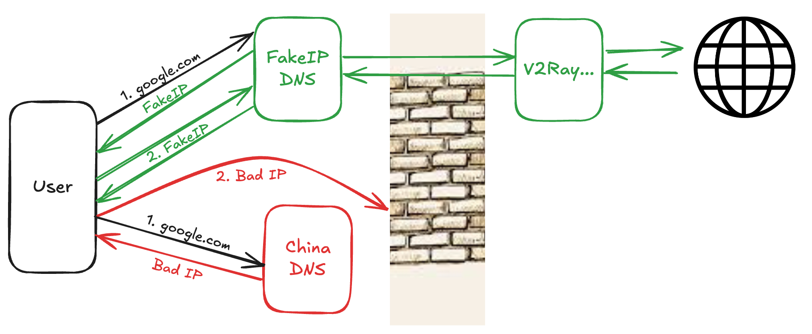
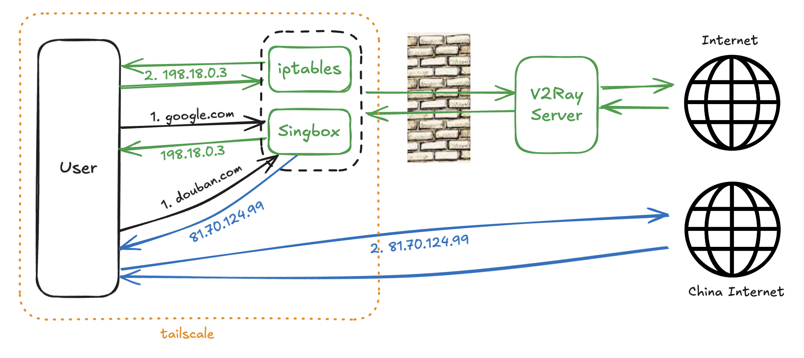
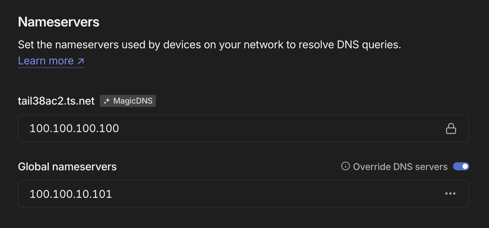
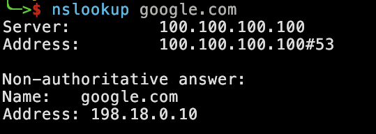

# Tailscale + Singbox FakeIP = Seamless VPN access

Recently I needed to connect my home Mac mini to GitHub as a runner. Unfornately, GitHub access is not stable in my country, so I need a seamless VPN solution. Previously I was using OpenClash, but never quite got it configured right, so this was the perfect opportunity to solve that too.

I’m using a solution I saw in the Neovim group on Telegram: Tailscale + FakeIP. It has these advantages:

- Automatic split-tunneling between domestic and overseas traffic seamlessly. Domestic traffic goes out via your normal local gateway. (Any FakeIP solution can do this, but using Tailscale’s native exit node alone cannot.)
- Outages of overseas services won’t take down domestic access, since only the overseas side would break. You just need to fix the overseas service.
- Connecting to Tailscale gives you access to both your home NAS and the Internet at once. Usually, you can only have one active VPN on mobile devices, but this solution give you benefits from both worlds.
- Simple to set up for friends or family, no complex config, and works on both home and mobile networks.

I’ve linked the original post and some reference configurations at the end of this post.

## Background

First, let’s review FakeIP. As you may know, DNS maps a domain name to an IP address. But in some countries, DNS often fails or returns the wrong IP, and even when it returns the correct IP, the connection may still be blocked. To solve that, you can roll your own DNS server(A) that always returns a placeholder IP, called a FakeIP, in a reserved IP range. When your app or browser asks DNS server(A) for “example.com,” it returns, let's say, `198.18.0.5`. Then you can configure your routing table to route "all request to `198.18.0.0/15`" to machine B, which have access to the real Internet. Machine B then do a reverse DNS look up, using the FakeIP(`198.18.0.5`), and finds out the real domain you intended, then it fetches the real site, relaying it backwards. Note that, in practice DNS A and machine B are probably the same machine.



Next, what is Tailscale? Simply put, Tailscale is a peer-to-peer VPN that stitches all your devices into one virtual LAN, so you can access your private services like you are on your home or office network.

Why do we combine them? Experienced users may have already set up FakeIP-based DNS/proxy on their OpenWrt router, so they can transparently browse overseas sites at home. But once you leave home, it no longer works. Tailscale gives you that same on-prem LAN experience from anywhere. You just point your DNS and routes to the tailnet’s internal FakeIP server, which is basically lifting your OpenWrt experience into the cloud.

## Implementation Steps

In my setup, I leveraged Mihomo’s built-in DNS (instead of the more popular mosdns). The overall architecture looks like this:



**Note, we switched to mihomo recently**

Tested on **Ubuntu 24.04 LTS** with **Mihomo** and **Tailscale 1.90+**.

### Step 1. Buy a VPS server

Spin up a VPS and join the tailnet. **NOTE**: allow inbound UDP from any address in the security group (Tailscale needs that for hole punching).

Install Tailscale via the official one-liner, which sets up the apt repo and signing key:

```sh
curl -fsSL https://tailscale.com/install.sh | sh
sudo tailscale up

# Advertise the private IP range
sudo tailscale set \
  --advertise-routes=198.18.0.0/15 \
  --accept-dns=false
```

`--accept-dns=false` is very important, it avoids tailscale from DNS loop, because the DNS server itself is the DNS.

Then, approve the route in the Tailscale admin console.

### Step 2. Install Mihomo

Install Mihomo from the official GitHub release page

```sh
curl -O -L https://github.com/MetaCubeX/mihomo/releases/download/v1.19.25/mihomo-linux-amd64-v1.19.25.gz
gunzip mihomo-linux-amd64-v1.19.25.gz
chmod +x mihomo-linux-amd64-v1.19.25
mv mihomo-linux-amd64-v1.19.25 /usr/local/bin/mihomo
```

Copy config and enable daemon

```
mkdir /etc/mihomo
cp mihomo/config.yaml /etc/mihomo
cp mihomo/mihomo.service /etc/systemd/system/
systemctl daemon-reload
systemctl enable --now mihomo
```

Verify that it's indeed mihomo listening to 53 port

```
sudo ss -lntup | grep ':53'
sudo ss -lnuup | grep ':53'
ip addr | grep -A3 mihomo
ip route | grep 198.18
```

Stop `systemd-resolved` if needed.


### Step 3. Open DNS to tailnet

```
sudo ufw allow in on tailscale0 proto udp to any port 53
sudo ufw allow in on tailscale0 proto tcp to any port 53

# Do not open 53 to the public internet
sudo ufw deny in proto udp to any port 53
sudo ufw deny in proto tcp to any port 53
```

### Step 4. Update Tailscale DNS

Point your tailnet’s custom DNS to the VPS’s tailnet IP, with “override” enabled:



Join the tailnet from your local machine and verify:




### Step 5. Accept the subroutes and DNS

On Linux clients:

```sh
sudo tailscale set --accept-dns=true --accept-routes=true
```

On other clients: Use the GUI config.

Verify:

```
nslookup google.com  -> 198.18.0.x
```

```
nslookup google.cn -> real_ip
```

### (Optional) Step 6. Set up a DERP server

Tailscale uses DERP server for hole-punching and traffic-relaying when a direct connect between two peers is not possible.
However, the DERP server may be too slow or blocked in your region. To overcome this, you can setup you own DERP servers.

On a new host, let's say: `derp.example.com(10.10.10.10)`. You'll need a public-facing 443 port (derper uses Let's Encrypt by default for its TLS cert) and a real DNS A/AAAA record for `derp.example.com`.

```sh
sudo apt install -y golang   # 1.22+ on noble; or download a tarball from go.dev
# If golang's module proxy is blocked from your VPS, point it at a mirror first:
go env -w GOPROXY=https://goproxy.cn,direct

go install tailscale.com/cmd/derper@latest
sudo install -m 0755 ~/go/bin/derper /usr/local/bin/derper

# Run it as a systemd service rather than from a shell:
sudo tee /etc/systemd/system/derper.service >/dev/null <<'EOF'
[Unit]
Description=Tailscale DERP relay
After=network-online.target
Wants=network-online.target

[Service]
ExecStart=/usr/local/bin/derper --hostname=derp.example.com --certmode=letsencrypt --certdir=/var/lib/derper
Restart=on-failure
DynamicUser=yes
StateDirectory=derper
AmbientCapabilities=CAP_NET_BIND_SERVICE

[Install]
WantedBy=multi-user.target
EOF
sudo systemctl daemon-reload
sudo systemctl enable --now derper
```

Edit the ACL file on tailscale.com

```json
{
  // ... other parts of tailnet policy file
  "derpMap": {
    "Regions": {
        // disable all default derp server.
        "1":  null,
        "10": null,
        "11": null,
        "12": null,
        "13": null,
        "14": null,
        "15": null,
        "16": null,
        "17": null,
        "18": null,
        "19": null,
        "2":  null,
        "20": null,
        "21": null,
        "22": null,
        "23": null,
        "24": null,
        "25": null,
        "26": null,
        "27": null,
        "28": null,
        "3":  null,
        "4":  null,
        "5":  null,
        "6":  null,
        "7":  null,
        "8":  null,
        "9":  null,

      // enable custom server
      "900": {
        "RegionID": 900,
        "RegionCode": "myderp",
        "Nodes": [
          {
            "Name": "1",
            "RegionID": 900,
            "HostName": "derp.example.com",
            // IPv4 and IPv6 are optional, but recommended, to reduce
            // potential DERP connectivity issues if DNS is unavailable
            // or having issues. Addresses must be publicly routable
            // and not in private IP ranges.
            "IPv4": "10.10.10.10",
            "IPv6": "2001:db8::1"
          }
        ]
      }
    }
  }
}
```

Now, the derp server should be the only one in your tailnet.

## Known Issues and Possible Improvements

- All overseas bandwidth goes through your VPS, so you’re bandwidth-limited by it. I’m on a Tencent Cloud 200 Mbps unlimited plan for CNY 45/mo, which is fine for me.
- Apps like Telegram that hardcode IPs need special handling — Telegram supports SOCKS so the `mixed-in` inbound on `:7890` works for it.
- When switching networks there's a noticeable lag; toggling Tailscale off/on usually fixes it.
- You can chain AdGuard Home as an upstream resolver to block ads.
- IPv6 isn't routed through FakeIP here — only `inet4_range` is set. Add `inet6_range` and a v6 nftables chain if you want symmetric v6 coverage.

## References

1. [Original post outlining the idea](https://blog.zwlin.io/post/tailscale-with-fakeip/)
2. [mosdns setup with loyalsoilder geoip data](https://github.com/IrineSistiana/mosdns/discussions/605)
3. [Tailscale DNS documentation](https://tailscale.com/kb/1054/dns)
4. [Another mosdns guide](https://songchenwen.com/tproxy-split-by-dns)
5. [Singbox configuration examples](https://shinya.click/fiddling/fake-ip-based-transparent-proxy/)
6. [AdGuard Home setup](https://hub.docker.com/r/adguard/adguardhome)
7. [Tailscale subnet routing guide](https://tailscale.com/kb/1019/subnets)
8. [RFC 5735 (reserved IP ranges)](https://www.rfc-editor.org/rfc/rfc5735)
9. [VMess to singbox config conversion tool](https://v2ray-to-sing-box.pages.dev/)
10 [DERP servers](https://tailscale.com/kb/1118/custom-derp-servers)
